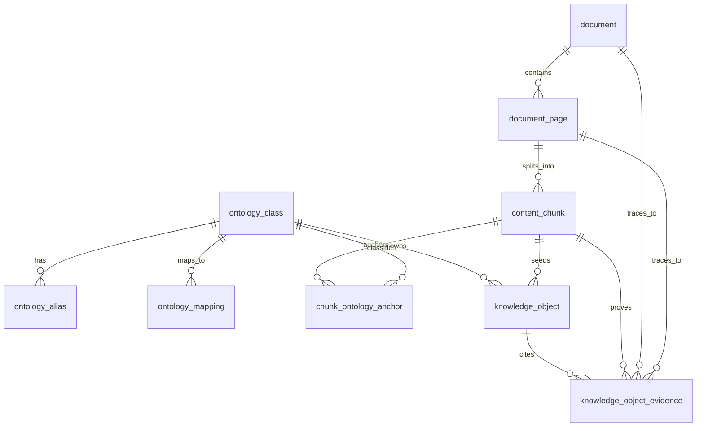

# Rebuild Storage Contract

**Status:** Rebuild Design Contract
**Last Updated:** 2026-03-17

This document defines the proposed storage contract for the ontology-first
rebuild track.

It is intentionally additive and reversible. This document does **not** approve
database migrations by itself. It freezes the table/field direction that future
migrations should follow after package contracts are accepted.

---

## Why This Exists

The rebuild now has a minimal executable ontology package contract and an HVAC
`v2` skeleton, but the persistence model still reflects only the legacy
document/page/chunk baseline.

Current active storage covers:

- `document`
- `document_page`
- `content_chunk`
- `processing_job`
- `processing_stage_log`

Current gaps:

- no persisted ontology class catalog
- no persisted alias or external mapping lookup
- no chunk-to-ontology anchor table
- no typed knowledge object storage
- no evidence table for multi-chunk support of a knowledge object

The rebuild cannot safely design semantic APIs until this storage shape is
stable.

---

## Non-Negotiable Rules

1. The six-layer evidence path remains `Document -> Page -> Chunk -> Knowledge Object -> Delivery`.
2. `content_chunk` remains the retrieval truth source and is not replaced by ontology or knowledge tables.
3. No project-instance topology, point binding, runtime telemetry, or control-state data enters this schema.
4. Ontology package files remain the authoring source of truth; database copies are read-optimized projections.
5. All new storage must be additive first. Legacy tables and endpoints remain intact until consumers migrate.
6. Canonical ontology ids are only guaranteed to be unique within a domain package, so persistence must be domain-scoped.

---

## Current State vs Gap

### Current State

- `content_chunk.evidence_anchor` stores location metadata only as opaque text.
- There is no place to persist canonical class ids from `domain_packages/*/v2/ontology/classes.yaml`.
- There is no normalized alias lookup for multilingual terminology.
- There is no durable relation between chunks and ontology classes.
- There is no generic, typed storage for semantic knowledge objects.

### Gap To Rebuild Target

The rebuild architecture requires:

- ontology-backed class lookup
- class alias and external mapping resolution
- chunk anchors to canonical classes
- knowledge objects attached to ontology classes
- evidence rows that preserve document, page, and chunk traceability

---

## Minimal Reversible Path

The recommended migration path is:

1. Add new ontology and knowledge tables without modifying existing baseline tables.
2. Backfill ontology metadata from `domain_packages/*/v2`.
3. Start writing chunk anchors from rebuild-track extraction jobs while legacy retrieval keeps using `content_chunk`.
4. Start writing knowledge objects and evidence rows for semantic delivery.
5. Only after stable consumers exist, consider deprecating legacy fact-specific assumptions.

This avoids risky edits to `document`, `document_page`, and `content_chunk` while
allowing the rebuild to advance.

---

## Identity Rule

Canonical ids from `classes.yaml` such as `fault_code` or `parameter_spec` are
not globally unique across all domains. They are only unique inside a domain
package.

Because of that, persistence should use:

- `domain_id` as the package scope
- `ontology_class_id` as the local canonical id from the package
- `ontology_class_key` as the storage key composed from `domain_id` and `ontology_class_id`

Example storage keys:

- `hvac:centrifugal_chiller`
- `hvac:fault_code`
- `drive:variable_frequency_drive`
- `drive:fault_code`

API and MCP contracts should therefore require `domain_id` whenever a query
needs to resolve an ontology class unambiguously.

---

## Proposed Tables

### `ontology_class`

Purpose:
Persist canonical ontology classes from a domain package version so APIs and
workers can query them without reparsing YAML on every request.

Required fields:

- `ontology_class_key`
- `ontology_class_id`
- `domain_id`
- `package_version`
- `ontology_version`
- `parent_class_id`
- `class_kind`
- `primary_label`
- `labels_json`
- `knowledge_anchors_json`
- `is_active`

Notes:

- `ontology_class_id` stores the canonical snake_case id from `classes.yaml`.
- `ontology_class_key` is the persisted scoped key, for example `hvac:chiller`.
- `labels_json` preserves multilingual labels.
- `knowledge_anchors_json` mirrors the package contract and avoids introducing a
  separate anchor-capability table too early.

### `ontology_alias`

Purpose:
Resolve user terms, extraction matches, and multilingual vocabulary to
canonical ontology classes.

Required fields:

- `alias_id`
- `ontology_class_key`
- `ontology_class_id`
- `domain_id`
- `language_code`
- `alias_text`
- `normalized_alias`
- `is_preferred`

Notes:

- `normalized_alias` should be lowercased and normalization-rule aware.
- The unique key is `(domain_id, ontology_class_id, language_code, normalized_alias)`.

### `ontology_mapping`

Purpose:
Persist interoperability mappings from canonical classes to external standards
such as Brick.

Required fields:

- `mapping_id`
- `ontology_class_key`
- `ontology_class_id`
- `domain_id`
- `mapping_system`
- `external_id`
- `mapping_metadata_json`
- `is_primary`

Notes:

- `mapping_system` starts with `brick`.
- Additional systems such as Haystack or vendor catalogs can be added later
  without altering the core table shape.

### `chunk_ontology_anchor`

Purpose:
Attach one chunk to one or more ontology classes without changing chunk
ownership or truth-source semantics.

Required fields:

- `chunk_anchor_id`
- `chunk_id`
- `ontology_class_key`
- `ontology_class_id`
- `domain_id`
- `match_method`
- `confidence_score`
- `is_primary`
- `match_metadata_json`

Notes:

- This table is the semantic bridge between Layer 3 chunks and Layer 4
  knowledge objects.
- `content_chunk.evidence_anchor` continues to represent positional evidence,
  not ontology identity.
- The unique key is `(chunk_id, ontology_class_key)`.

### `knowledge_object`

Purpose:
Store typed, evidence-backed knowledge objects attached to ontology classes.

Required fields:

- `knowledge_object_id`
- `domain_id`
- `ontology_class_key`
- `ontology_class_id`
- `knowledge_object_type`
- `canonical_key`
- `structured_payload_json`
- `confidence_score`
- `trust_level`
- `review_status`
- `primary_chunk_id`
- `package_version`
- `ontology_version`

Optional but recommended:

- `title`
- `summary`
- `applicability_json`

Notes:

- `knowledge_object_type` examples: `fault_code`, `parameter_spec`,
  `maintenance_procedure`, `performance_spec`.
- `canonical_key` is the stable lookup handle inside a type and class scope,
  such as a fault code value or normalized parameter name.
- `confidence_score` is the object-level extraction or curation confidence used
  for semantic ranking and filtering.
- `primary_chunk_id` guarantees at least one traceable chunk even when multiple
  evidence rows exist.
- The unique key is `(domain_id, ontology_class_id, knowledge_object_type, canonical_key)`.

### `knowledge_object_evidence`

Purpose:
Persist one or more traceable evidence rows for each knowledge object.

Required fields:

- `knowledge_evidence_id`
- `knowledge_object_id`
- `chunk_id`
- `doc_id`
- `page_id`
- `page_no`
- `evidence_text`
- `evidence_role`
- `confidence_score`

Notes:

- This table preserves the mandatory path back to chunk, page, and document.
- `evidence_role` should start with `primary` or `supporting`.
- Writers must copy `doc_id`, `page_id`, and `page_no` from the referenced
  chunk/page chain instead of inventing standalone evidence coordinates.

---

## Deferred Review Model

The rebuild plan mentions a review status model. For the minimum reversible
path, the first draft keeps:

- `review_status` on `knowledge_object`
- `trust_level` on `knowledge_object`

Detailed review audit history should become a separate table later, after the
first semantic read path is working. That avoids overdesigning workflow before
the core persistence model is proven.

---

## Entity Relationship Sketch

---

## Write Path Rules

1. Ontology tables are written from package ingestion or synchronization, not from free-form runtime mutation.
2. Chunk anchors are written only after a chunk exists.
3. Knowledge objects are written only after at least one chunk anchor or direct chunk evidence exists.
4. Knowledge object evidence rows are mandatory for semantic delivery; no evidence means no publishable object.
5. Search indexes remain derived from chunks and later from knowledge objects, never the reverse.

---

## What This Change Does Not Approve

- no Alembic migration yet
- no updates to `packages.db.session.init_db`
- no semantic API endpoint changes yet
- no write path for project instances, site topology, telemetry, or controls
- no attempt to replace `content_chunk` with denormalized semantic rows
